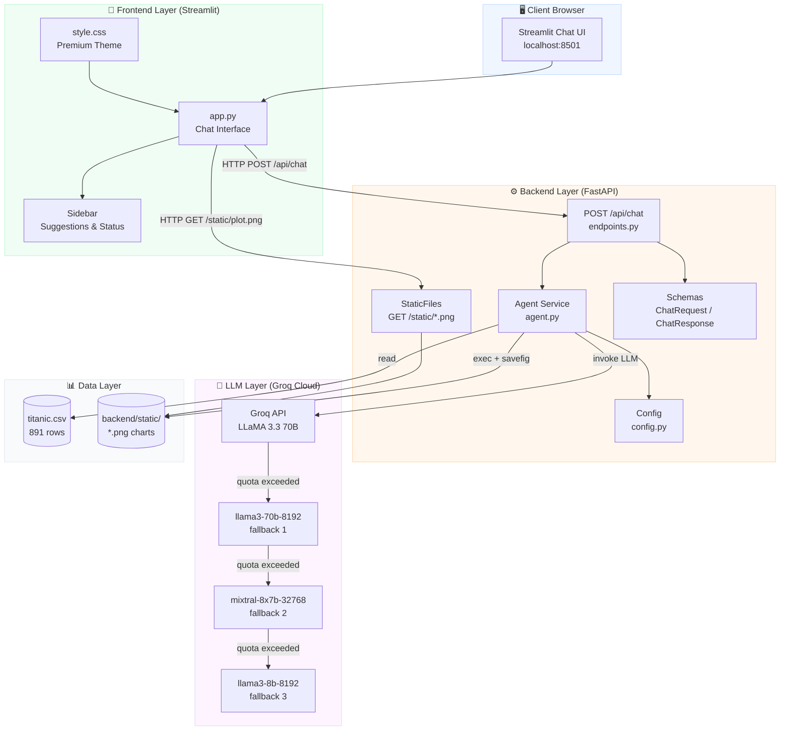
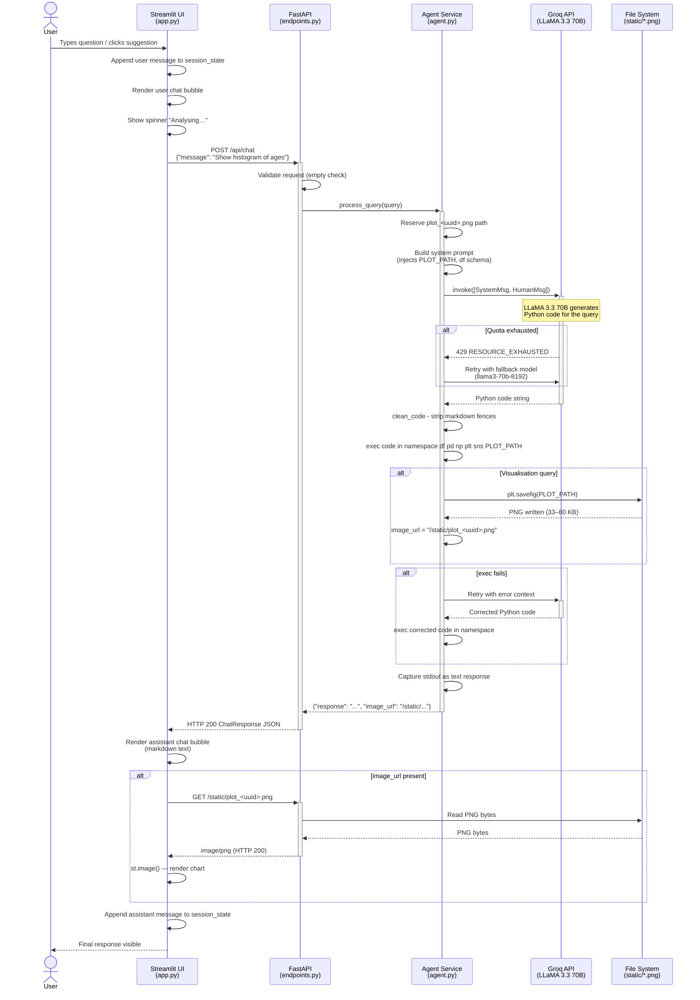
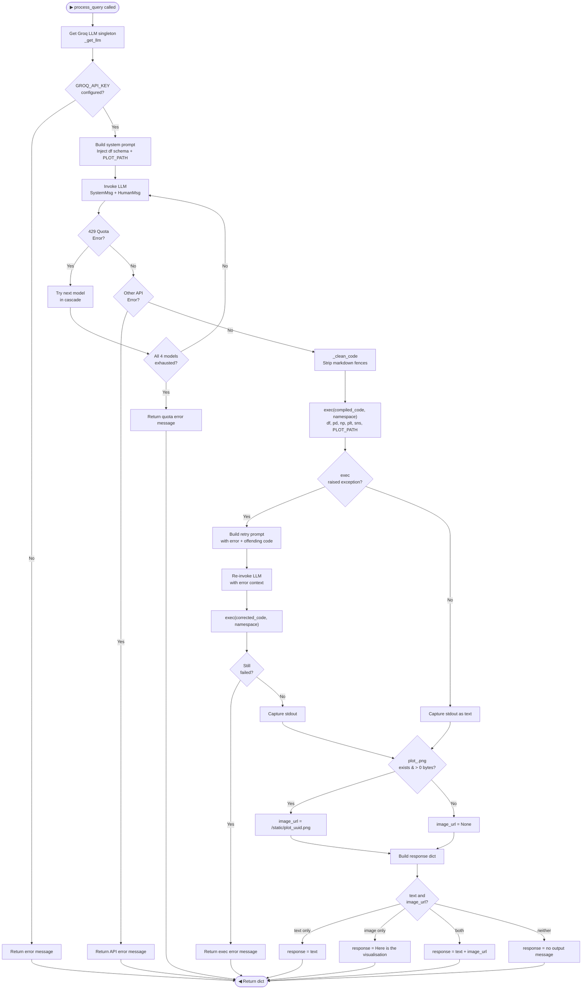
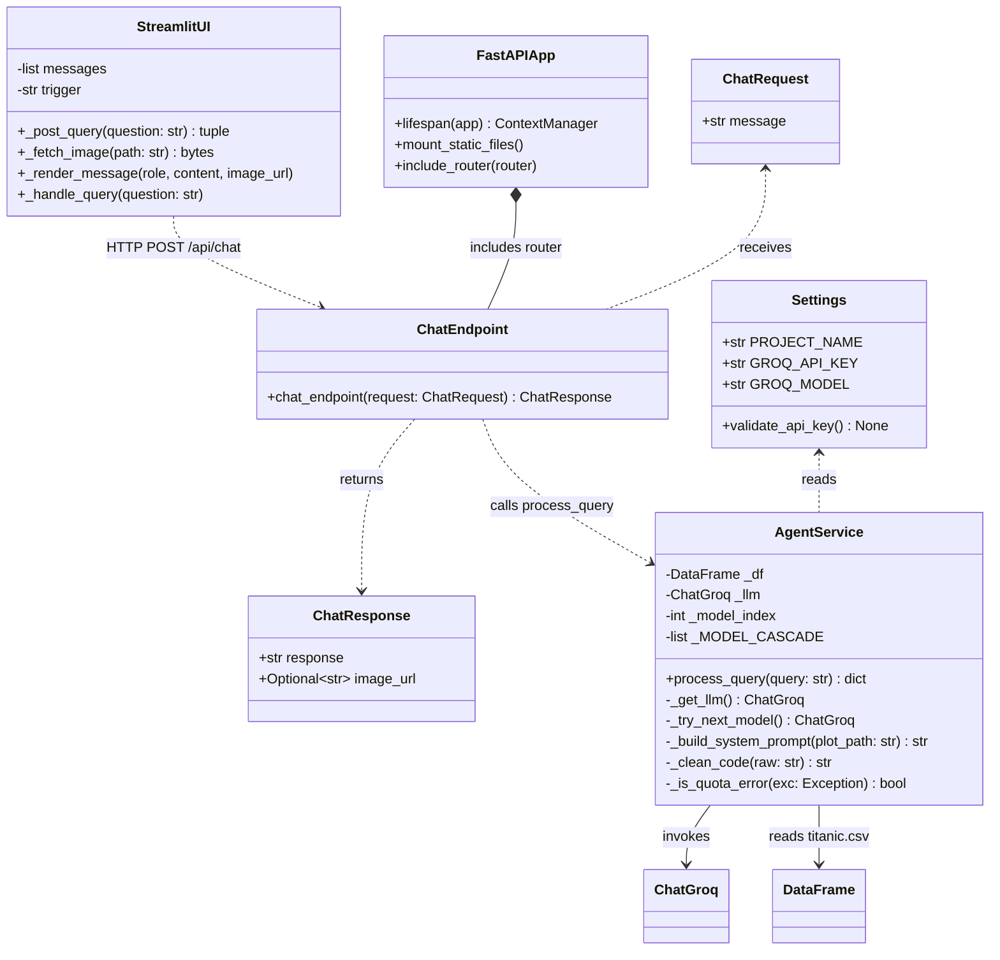
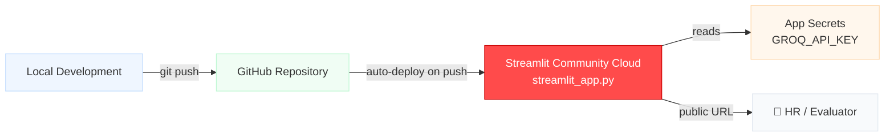

# 🚢 Titanic Dataset Chat Agent

<div align="center">

**Author: PAMIDI ROHIT**


*A full-stack AI chatbot that answers natural-language questions about the Titanic passenger dataset and generates data visualisations on demand.*

</div>

---

## 📋 Table of Contents

- [Architecture Overview](#architecture-overview)
- [System Architecture Diagram](#system-architecture-diagram)
- [Sequence Diagram](#sequence-diagram)
- [Agent Processing Flowchart](#agent-processing-flowchart)
- [UML Class Diagram](#uml-class-diagram)
- [Features](#features)
- [Tech Stack](#tech-stack)
- [Getting Started](#getting-started)
- [Project Structure](#project-structure)
- [Example Questions](#example-questions)
- [Deployment](#deployment)

---

## Architecture Overview

The system follows a **3-tier architecture**:

| Tier | Component | Technology |
|------|-----------|------------|
| **Presentation** | Chat UI with sidebar, suggestion buttons, chart rendering | Streamlit 1.49 |
| **Application** | REST API, LLM orchestration, code execution | FastAPI + LangChain + Groq |
| **Data** | Titanic CSV (891 rows × 12 cols), Generated PNG charts | pandas + matplotlib |

---

## System Architecture Diagram



---

## Sequence Diagram

Shows the complete lifecycle of a user query — from input to rendered response.



---

## Agent Processing Flowchart

Internal logic of `agent.py` — how a raw query becomes a structured response.



---

## UML Class Diagram

Module-level structure of the backend.



---

## Features

- **Natural language queries** — ask anything about the Titanic dataset in plain English
- **Statistical answers** — percentages, averages, counts, markdown tables
- **Visualisations** — histograms, bar charts, pie charts, box plots, scatter plots, heatmaps
- **Survival analysis** — by gender, class, age, embarkation port, family size
- **Sidebar suggestions** — one-click prompts organised by category
- **Chat history** — full conversation retained in Streamlit session state
- **Backend health badge** — sidebar shows ✅ / ❌ live backend status
- **Model cascade fallback** — switches through 4 Groq models if one hits rate limits

---

## Tech Stack

| Component | Technology | Version |
|-----------|-----------|---------|
| Language | Python | 3.12 |
| Backend API | FastAPI + Uvicorn | 0.133 / 0.34 |
| LLM Framework | LangChain + langchain-groq | 1.2 / 0.3 |
| LLM Provider | Groq Cloud — LLaMA 3.3 70B | Free tier 14,400 req/day |
| Data Processing | pandas + numpy | 3.0 / 2.1 |
| Visualisation | matplotlib + seaborn | 3.10 / 0.13 |
| Frontend | Streamlit | 1.49 |
| Containerisation | Docker + Docker Compose | 3.8 |
| Deployment | Streamlit Community Cloud / Render | — |

---

## Getting Started

### Prerequisites

- Docker & Docker Compose **or** Python 3.10+
- Free Groq API key → [console.groq.com/keys](https://console.groq.com/keys)

### 1. Clone & Configure

```bash
git clone https://github.com/YOUR_USERNAME/titanic-chat-agent.git
cd titanic-chat-agent
cp .env.example .env
```

Edit `.env`:
```env
GROQ_API_KEY=your_groq_api_key_here
GROQ_MODEL=llama-3.3-70b-versatile
```

### 2a. Run with Docker Compose (recommended)

```bash
docker-compose up --build
```

| Service | URL |
|---------|-----|
| Streamlit Chat UI | http://localhost:8501 |
| FastAPI Swagger Docs | http://localhost:8000/docs |
| Backend Health Check | http://localhost:8000/health |

### 2b. Run Locally (without Docker)

**Backend:**
```bash
python -m venv backend/.venv
source backend/.venv/bin/activate        # Windows: backend\.venv\Scripts\activate
pip install -r backend/requirements.txt
uvicorn backend.main:app --reload --port 8000
```

**Frontend** (separate terminal):
```bash
pip install streamlit requests
BACKEND_URL=http://localhost:8000 streamlit run frontend/app.py --server.port 8501
```

**Standalone** (no separate backend — for Streamlit Cloud):
```bash
pip install -r requirements.txt
export GROQ_API_KEY=your_key
streamlit run streamlit_app.py
```

---

## Project Structure

```
TailorTalk-Ass/
│
├── streamlit_app.py          # Standalone app (Streamlit Cloud)
├── requirements.txt          # Root deps for Streamlit Cloud
│
├── backend/
│   ├── main.py               # FastAPI entry — lifespan, StaticFiles, router
│   ├── requirements.txt      # Backend-only dependencies
│   ├── api/
│   │   └── endpoints.py      # POST /api/chat  →  ChatResponse
│   ├── core/
│   │   └── config.py         # Pydantic settings (reads .env)
│   ├── data/
│   │   └── titanic.csv       # Dataset — 891 rows × 12 columns
│   ├── models/
│   │   └── schemas.py        # ChatRequest / ChatResponse Pydantic models
│   ├── services/
│   │   └── agent.py          # Groq code-gen agent (exec pipeline)
│   └── static/               # Runtime-generated PNG charts (gitignored)
│
├── frontend/
│   ├── app.py                # Streamlit UI — talks to FastAPI backend
│   ├── style.css             # Professional SaaS light-mode CSS
│   └── requirements.txt      # streamlit, requests
│
├── .streamlit/
│   └── config.toml           # Streamlit theme (primaryColor, fonts)
│
├── Dockerfile.backend        # Multi-stage FastAPI image
├── Dockerfile.frontend       # Streamlit image
├── docker-compose.yml        # One-command startup
├── render.yaml               # Render.com production deploy config
├── .env.example              # Environment variable template
└── .gitignore
```

---

## Example Questions

| # | Category | Question | Response Type |
|---|----------|---------|--------------|
| 1 | Statistics | "What percentage of passengers were male on the Titanic?" | Text |
| 2 | Statistics | "What was the average ticket fare?" | Text |
| 3 | Statistics | "How many passengers embarked from each port?" | Markdown table |
| 4 | Statistics | "What is the survival rate by gender?" | Text |
| 5 | Visualisation | "Show me a histogram of passenger ages" | Chart |
| 6 | Visualisation | "Plot survival rate by passenger class as a bar chart" | Chart |
| 7 | Visualisation | "Show a heatmap of feature correlations" | Chart |
| 8 | Visualisation | "Plot fare distribution by class using a box plot" | Chart |
| 9 | Survival | "How did age affect survival chances?" | Text / Chart |
| 10 | Survival | "What percentage of children (age < 16) survived?" | Text |

---

## Deployment — Streamlit Community Cloud



**Steps:**
1. Push to GitHub
2. Visit [share.streamlit.io](https://share.streamlit.io) → **New app**
3. Repo: `YOUR_USERNAME/titanic-chat-agent` | Branch: `main` | File: `streamlit_app.py`
4. **Advanced → Secrets:**
   ```toml
   GROQ_API_KEY = "gsk_your_key_here"
   ```
5. Click **Deploy** — get a shareable `https://your-app.streamlit.app` URL

---

## Notes

- The agent asks Groq LLaMA 3.3 70B to write Python code, then runs it with `exec()` in a private namespace containing the Titanic DataFrame. This is more reliable than tool-calling agents because LLMs sometimes skip tool calls for visualisation queries.
- Groq free tier: **14,400 requests/day** — sufficient for development and demos.
- The LLM is **lazily initialised** on the first request so the server starts instantly.
- Generated PNGs are stored in `backend/static/` (ephemeral — gitignored, Docker-volume-mounted).

---

<div align="center">
<sub>Built by <strong>PAMIDI ROHIT</strong> · Powered by Groq · LLaMA 3.3 70B · Streamlit · FastAPI</sub>
</div>
